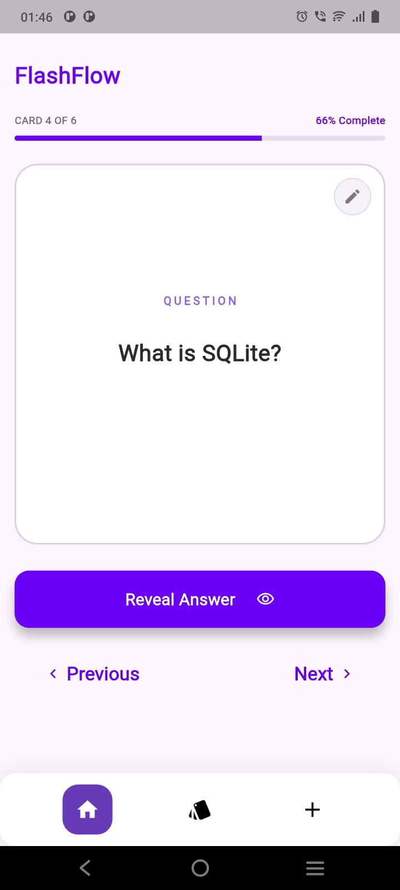
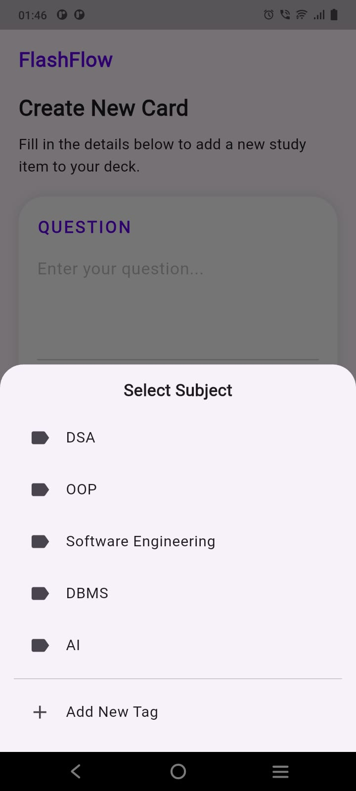
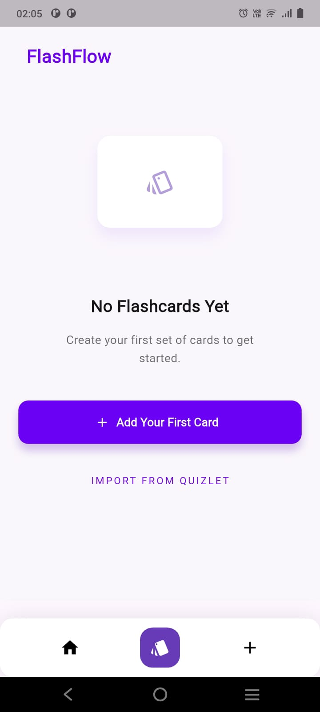
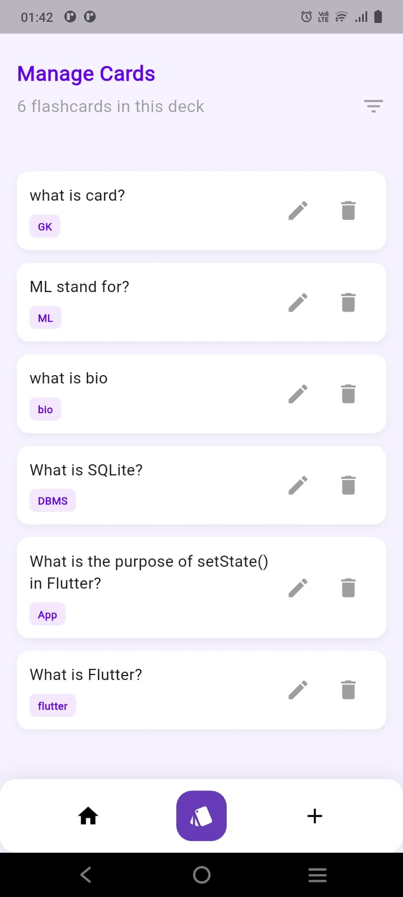

# 📚 FlashFlow - Flashcard Quiz App

FlashFlow is a Flutter-based flashcard application designed to help users study efficiently using digital flashcards. Users can create, edit, delete, and review flashcards while storing all data locally using SQLite (sqflite).

---

## ✨ Features

- 📖 View all flashcards
- ➕ Create new flashcards
- ✏️ Edit existing flashcards
- 🗑️ Delete flashcards
- 💾 Local data storage using SQLite (sqflite)
- 🏷️ Categorize flashcards with tags
- 🔍 Manage flashcards in a clean interface
- 📚 Study flashcards one by one
- 👀 Reveal/Hide answers
- ⏭️ Next and Previous card navigation
- 📱 Responsive Material UI

---

## 📱 Screens

- Home Screen
- Manage Cards Screen
- Create Flashcard Screen
- Empty State Screen

---

## 🛠️ Tech Stack

- Flutter
- Dart
- Provider (State Management)
- MVVM Architecture
- SQFlite (Local Database)
- Material Design

---

## 📂 Project Structure

```
lib/
├── db/
├── model/
├── viewModel/
├── ui/
└── main.dart
```

---

## 🗄️ Database

SQLite is used to store flashcards locally on the user's device.


## 🚀 Functionality

### Add Flashcard

- Enter Question
- Enter Answer
- Select Tag
- Save to SQLite Database

### Manage Flashcards

- View all saved flashcards
- Edit any flashcard
- Delete any flashcard

### Study Mode

- View Question
- Reveal Answer
- Hide Answer
- Navigate using Next/Previous buttons

---

## 🏗️ Architecture

This project follows the MVVM (Model-View-ViewModel) architecture.

- Model
- View
- ViewModel
- Database Layer

State management is handled using **Provider**.

---

## 📸 Screenshots

<table align="center">
  <tr>
    <td align="center">
      <br>
      <b>Home Screen</b>
    </td>
    <td align="center">
      <br>
      <b>Manage Cards</b>
    </td>
    <td align="center">
      <br>
      <b>Add Flashcard</b>
    </td>
  </tr>

  <tr>
    <td align="center">
      <br>
      <b>Edit Flashcard</b>
    </td>
    <td align="center">
      <br>
      <b>Quiz Screen</b>
    </td>
    <td align="center">
      <br>
      <b>Answer Revealed</b>
    </td>
  </tr>
</table>


